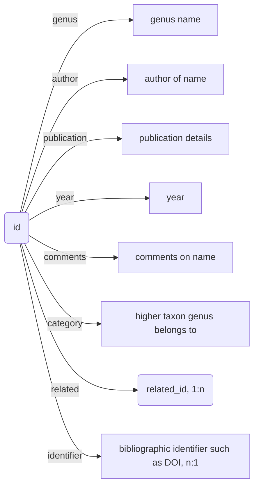

nomenclator-zoologicus
======================


Mapping between the digitised version of [Nomenclator Zoologicus](http://uio.mbl.edu/NomenclatorZoologicus/) from uBio, and bibliographic databases such as the Biodiversity Heritage Library (BHL).

The original tab-delimited data set supplied by David Remsen is in the data folder. A recent SQL dump of the database is in the sql folder.

For background to the original data set see:

Remsen, D. P., Norton, C., & Patterson, D. J. (2006). Taxonomic Informatics Tools for the Electronic Nomenclator Zoologicus. The Biological Bulletin, 210(1), 18–24. https://doi.org/10.2307/4134533

## Relationships between names

Based on a harvest of the uBio website we have table `nz_related` which has `(id, related_id`) tuples. `id` is unique but `related_id` is not, so direction is asymmetric and if we store in same table as then names then can store `related_id` in `id` row.

An example where `related_id` is not unique is `106118` which is the genus *Leptusa*. There are 44 names related to this one, they are all names that were originally proposed as subgenera of *Leptusa*.


```
select * from nz
inner join nz_related ON nz.id = nz_related.id
where nz_related.related_id= 106118;
```

2022-05-25 Currently `nz` doesn’t do this correctly, `nz.related_id` should be the same as `nz_related.related_id`. Will need to reload and also reclassify the relationships. Could use [Nomenclatural Status GBIF Vocabulary](https://rs.gbif.org/vocabulary/gbif/nomenclatural_status.xml) If we export this as Darwin Core could use [Darwin Core Resource Relationship](https://rs.gbif.org/extension/dwc/resource_relationship_2022-02-02.xml)




## Notes

### Matching to BHL

The script `bhl_match.php` will take a BHL ItemID and corresponding SQL query and try and match BHL pages to citations. Useful for cases where lots of names come from the same work (e.g., a book).

### Matching to Wikidata

To do:

